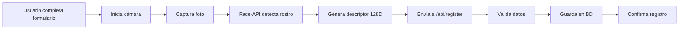
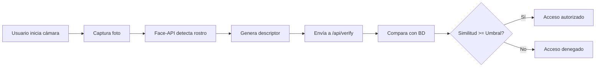

# 🔐 Sistema de Control de Acceso - Reconocimiento Facial

Sistema completo de control de acceso mediante reconocimiento facial biométrico basado en **Node.js**, **Express**, **MySQL** y **Face-API.js**.


---

## 📋 Tabla de Contenidos

- [Características](#-características)
- [Tecnologías](#-tecnologías)
- [Arquitectura](#-arquitectura)
- [Requisitos Previos](#-requisitos-previos)
- [Instalación](#-instalación)
- [Configuración](#-configuración)
- [Uso](#-uso)
- [API REST](#-api-rest)
- [Base de Datos](#-base-de-datos)
- [Seguridad y Privacidad](#-seguridad-y-privacidad)
- [Resolución de Problemas](#-resolución-de-problemas)
- [Roadmap](#-roadmap)

---

## ✨ Características

### Funcionalidades Implementadas

✅ **Registro de Usuarios**
- Formulario completo con validación
- Captura facial en tiempo real
- Generación de descriptores faciales (128 dimensiones)
- Almacenamiento seguro en base de datos
- Validación de duplicados (email e identificación)

✅ **Verificación de Acceso**
- Reconocimiento facial en tiempo real
- Comparación con descriptores almacenados
- Sistema de puntuación de similitud configurable
- Registro completo de accesos (autorizados y denegados)
- Feedback visual inmediato

✅ **Gestión de Datos**
- Base de datos MySQL robusta
- Almacenamiento de fotos de registro y verificación
- Log completo de accesos con timestamps
- Vistas y procedimientos almacenados
- Configuración dinámica del sistema

✅ **Panel de Administración** 🆕
- Dashboard con estadísticas en tiempo real
- Gestión completa de usuarios (activar/desactivar)
- **Sistema de Gestión de Turnos** 🕒
  - Crear y configurar turnos con horarios específicos
  - Asignar múltiples turnos a usuarios
  - Validación automática de acceso según turno
  - Control de fechas de inicio/fin de asignaciones
- Visualización del historial de accesos
- Configuración de parámetros del sistema
- Limpieza de base de datos
- Interfaz protegida por contraseña

✅ **Interfaz de Usuario**
- Diseño moderno y responsivo
- Dos modos: Registro y Verificación
- Mensajes de estado en tiempo real
- Overlay informativos sobre el video
- Compatible con dispositivos móviles

---

## 🛠️ Tecnologías

### Backend
- **Node.js** v14+ - Runtime de JavaScript
- **Express.js** v4 - Framework web
- **MySQL** v5.7+ / v8+ - Base de datos relacional
- **mysql2** - Driver MySQL con soporte de promesas
- **dotenv** - Gestión de variables de entorno
- **body-parser** - Procesamiento de JSON
- **cors** - Control de acceso CORS

### Frontend
- **HTML5** - Estructura
- **CSS3** - Estilos (gradientes, animaciones, responsivo)
- **JavaScript ES6+** - Lógica del cliente
- **Face-API.js** v0.22 - Detección y reconocimiento facial
- **WebRTC** - Acceso a la cámara

### Machine Learning
- **Face-API.js** con modelos pre-entrenados:
  - `ssd_mobilenetv1` - Detección de rostros
  - `face_landmark_68` - Puntos de referencia faciales
  - `face_recognition` - Descriptores faciales de 128 dimensiones

---

## 🏗️ Arquitectura

```
┌─────────────────┐
│   Navegador     │
│  (HTML/CSS/JS)  │
│   Face-API.js   │
└────────┬────────┘
         │ HTTP/REST
         ▼
┌─────────────────┐
│  Express.js     │
│  (Node.js)      │
│  - /api/register│
│  - /api/verify  │
│  - /api/usuarios│
└────────┬────────┘
         │ SQL
         ▼
┌─────────────────┐
│     MySQL       │
│  - usuarios     │
│  - descriptores │
│  - fotos        │
│  - accesos      │
└─────────────────┘
```

### Flujo de Registro



### Flujo de Verificación



---

## 📋 Requisitos Previos

### Software Necesario

- **Node.js** v14.0.0 o superior
- **npm** v6.0.0 o superior
- **MySQL** v5.7 o superior (o MariaDB v10.2+)
- Navegador moderno con soporte para:
  - WebRTC
  - getUserMedia API
  - ES6+

### Requisitos de Hardware

- Cámara web funcional
- Mínimo 2GB RAM
- Conexión a Internet (primera carga de modelos)

---

## 🚀 Instalación

### 1. Clonar o Descargar el Proyecto

```bash
cd /ruta/a/tu/proyecto
```

### 2. Instalar Dependencias

```bash
npm install
```

Esto instalará:
- express
- mysql2
- dotenv
- cors
- body-parser
- nodemon (dev)

### 3. Configurar Base de Datos

#### Opción A: Desde MySQL CLI

```bash
mysql -u root -p < database/schema.sql
```

#### Opción B: Desde MySQL Workbench

1. Abre MySQL Workbench
2. Conecta a tu servidor
3. Abre `database/schema.sql`
4. Ejecuta el script completo

El script creará:
- Base de datos `control_acceso`
- 5 tablas principales
- 2 vistas
- 1 procedimiento almacenado
- Configuraciones por defecto

### 4. Configurar Variables de Entorno

Crea un archivo `.env` en la raíz del proyecto:

```bash
# Configuración del servidor
PORT=3000

# Configuración de la base de datos MySQL
DB_HOST=localhost
DB_USER=root
DB_PASSWORD=tu_password_aqui
DB_NAME=control_acceso
DB_PORT=3306

# Configuración de reconocimiento facial
FACE_MATCH_THRESHOLD=0.6
```

**⚠️ IMPORTANTE:** Cambia `DB_PASSWORD` por tu contraseña real de MySQL.

---

## ⚙️ Configuración

### Ajustar Umbral de Similitud

El umbral determina cuán estricto es el reconocimiento facial:

- **0.4** - Muy estricto (puede rechazar al mismo usuario)
- **0.5** - Estricto
- **0.6** - Balanceado (recomendado) ⭐
- **0.7** - Permisivo
- **0.8+** - Muy permisivo (riesgo de falsos positivos)

#### Opción 1: En `.env`

```env
FACE_MATCH_THRESHOLD=0.6
```

#### Opción 2: En la base de datos

```sql
UPDATE configuracion 
SET valor = '0.65' 
WHERE clave = 'umbral_similitud';
```

### Configurar Retención de Datos

```sql
-- Retener fotos durante 30 días
UPDATE configuracion 
SET valor = '30' 
WHERE clave = 'dias_retencion_fotos';

-- Retener logs durante 90 días
UPDATE configuracion 
SET valor = '90' 
WHERE clave = 'dias_retencion_logs';
```

---

## 💻 Uso

### Iniciar el Servidor

#### Modo Producción

```bash
npm start
```

#### Modo Desarrollo (con auto-reload)

```bash
npm run dev
```

El servidor estará disponible en: **http://localhost:3000**

### Usar la Aplicación Web

1. **Abrir navegador**: Navega a `http://localhost:3000`

2. **Acceder al Panel de Administración** (opcional):
   - Haz clic en "⚙️ Admin" en la esquina superior derecha
   - O navega a: `http://localhost:3000/admin.html`
   - **Contraseña por defecto:** `admin123`
   - Lee `public/ADMIN_README.md` para más información

3. **Registrar un usuario**:
   - Ve a la pestaña "Registrar Usuario"
   - Completa el formulario
   - Haz clic en "Iniciar Cámara"
   - Posiciónate frente a la cámara con buena iluminación
   - Haz clic en "Registrar Usuario"
   - Espera la confirmación

3. **Verificar acceso**:
   - Ve a la pestaña "Verificar Acceso"
   - Haz clic en "Iniciar Cámara"
   - Posiciónate frente a la cámara
   - Haz clic en "Verificar Acceso"
   - El sistema te identificará automáticamente

4. **Gestionar turnos** (administrador):
   - Accede al Panel de Administración
   - Ve a la pestaña "Turnos"
   - Crea turnos con horarios específicos
   - Ve a la pestaña "Usuarios"
   - Haz clic en "🕒 Turnos" en el usuario deseado
   - Asigna uno o varios turnos con fechas de vigencia
   - Activa la validación de turnos en "Configuración"

### Recomendaciones para Mejor Precisión

✅ **Hacer:**
- Usar buena iluminación (luz natural o frontal)
- Mirar directamente a la cámara
- Mantener el rostro completo en el encuadre
- Evitar sombras pronunciadas
- Registrarse con la misma iluminación que se usará para verificación

❌ **Evitar:**
- Luz de fondo (contraluz)
- Gafas de sol o mascarilla
- Sombreros que oculten el rostro
- Movimiento durante la captura
- Iluminación muy diferente entre registro y verificación

---

## 📡 API REST

### Endpoints Disponibles

#### 1. Registrar Usuario

**POST** `/api/register`

Registra un nuevo usuario en el sistema con su descriptor facial.

**Request Body:**
```json
{
  "nombre": "Juan",
  "apellidos": "García López",
  "email": "juan.garcia@empresa.com",
  "identificacion": "12345678A",
  "departamento": "Tecnología",
  "cargo": "Desarrollador",
  "descriptor": [0.123, -0.456, ...], // Array de 128 números
  "image": "data:image/jpeg;base64,/9j/4AAQ..." // Base64
}
```

**Response (201 Created):**
```json
{
  "success": true,
  "message": "Usuario registrado exitosamente",
  "usuario": {
    "id": 1,
    "nombre": "Juan",
    "apellidos": "García López",
    "email": "juan.garcia@empresa.com",
    "identificacion": "12345678A",
    "departamento": "Tecnología",
    "cargo": "Desarrollador"
  }
}
```

**Errores Posibles:**
- `400` - Campos obligatorios faltantes
- `409` - Email o identificación ya registrados
- `500` - Error del servidor

---

#### 2. Verificar Acceso

**POST** `/api/verify`

Verifica un rostro contra la base de datos de usuarios registrados.

**Request Body:**
```json
{
  "descriptor": [0.123, -0.456, ...], // Array de 128 números
  "image": "data:image/jpeg;base64,/9j/4AAQ..." // Base64
}
```

**Response (200 OK) - Acceso Autorizado:**
```json
{
  "success": true,
  "message": "Acceso autorizado",
  "usuario": {
    "id": 1,
    "nombre": "Juan",
    "apellidos": "García López",
    "email": "juan.garcia@empresa.com",
    "identificacion": "12345678A",
    "departamento": "Tecnología",
    "cargo": "Desarrollador"
  },
  "similitud": 0.8234,
  "timestamp": "2024-01-15T10:30:00.000Z"
}
```

**Response (403 Forbidden) - Acceso Denegado:**
```json
{
  "success": false,
  "message": "Acceso denegado. No se reconoce el rostro o la similitud es insuficiente.",
  "similitud": 0.4521,
  "umbral_requerido": 0.6,
  "mejor_coincidencia": {
    "nombre": "María",
    "apellidos": "Pérez",
    "similitud": 0.4521
  }
}
```

**Errores Posibles:**
- `400` - Descriptor inválido
- `404` - No hay usuarios registrados
- `500` - Error del servidor

---

#### 3. Listar Usuarios

**GET** `/api/usuarios`

Obtiene la lista de todos los usuarios registrados con estadísticas.

**Response (200 OK):**
```json
{
  "success": true,
  "usuarios": [
    {
      "id": 1,
      "nombre": "Juan",
      "apellidos": "García López",
      "email": "juan.garcia@empresa.com",
      "identificacion": "12345678A",
      "departamento": "Tecnología",
      "cargo": "Desarrollador",
      "activo": true,
      "fecha_registro": "2024-01-10T08:00:00.000Z",
      "num_descriptores": 1,
      "total_accesos": 45,
      "ultimo_acceso": "2024-01-15T10:30:00.000Z"
    }
  ]
}
```

---

#### 4. Obtener Configuración

**GET** `/api/configuracion`

Obtiene todos los parámetros de configuración del sistema.

**Response (200 OK):**
```json
{
  "success": true,
  "configuracion": [
    {
      "id": 1,
      "clave": "umbral_similitud",
      "valor": "0.6",
      "descripcion": "Umbral mínimo de similitud facial..."
    }
  ]
}
```

---

#### 5. Actualizar Configuración (Admin)

**POST** `/api/configuracion`

Actualiza los parámetros del sistema.

**Request Body:**
```json
{
  "umbral_similitud": 0.65,
  "dias_retencion_fotos": 30,
  "dias_retencion_logs": 90,
  "max_descriptores_por_usuario": 3
}
```

**Response (200 OK):**
```json
{
  "success": true,
  "message": "Configuración actualizada correctamente"
}
```

---

#### 6. Activar/Desactivar Usuario (Admin)

**POST** `/api/usuarios/:id/desactivar`  
**POST** `/api/usuarios/:id/activar`

Activa o desactiva un usuario del sistema.

**Response (200 OK):**
```json
{
  "success": true,
  "message": "Usuario desactivado correctamente"
}
```

---

#### 7. Limpiar Base de Datos (Admin)

**POST** `/api/limpiar-bd`

Elimina todos los registros de usuarios, descriptores, fotos y accesos.

⚠️ **ADVERTENCIA:** Esta acción no se puede deshacer.

**Response (200 OK):**
```json
{
  "success": true,
  "message": "Base de datos limpiada correctamente"
}
```

---

#### 8. Listar Accesos

**GET** `/api/accesos?limit=50`

Obtiene el historial de accesos (autorizados y denegados).

**Query Parameters:**
- `limit` (opcional): Número máximo de registros (default: 50)

**Response (200 OK):**
```json
{
  "success": true,
  "accesos": [
    {
      "id": 123,
      "usuario_id": 1,
      "tipo_acceso": "entrada",
      "estado": "autorizado",
      "similitud_facial": 0.8234,
      "motivo_denegacion": null,
      "fecha_acceso": "2024-01-15T10:30:00.000Z",
      "ubicacion": "Sistema Web",
      "nombre_completo": "Juan García López",
      "identificacion": "12345678A",
      "departamento": "Tecnología"
    }
  ]
}
```

---

#### 9. Gestión de Turnos (Admin) 🕒

**GET** `/api/turnos`

Obtiene la lista de turnos configurados.

**Response (200 OK):**
```json
{
  "success": true,
  "turnos": [
    {
      "id": 1,
      "nombre": "Mañana",
      "descripcion": "Turno de mañana",
      "hora_inicio": "07:00:00",
      "hora_fin": "15:00:00",
      "dias_semana": "1,2,3,4,5",
      "color": "#4CAF50",
      "activo": true
    }
  ]
}
```

---

**POST** `/api/turnos`

Crea un nuevo turno.

**Request Body:**
```json
{
  "nombre": "Tarde",
  "descripcion": "Turno de tarde",
  "hora_inicio": "15:00",
  "hora_fin": "23:00",
  "dias_semana": [1,2,3,4,5],
  "color": "#FF9800"
}
```

---

**PUT** `/api/turnos/:id`

Actualiza un turno existente.

---

**DELETE** `/api/turnos/:id`

Desactiva un turno (no lo elimina físicamente).

---

#### 10. Asignación de Turnos a Usuarios (Admin)

**GET** `/api/usuarios/:id/turnos`

Obtiene los turnos asignados a un usuario.

**Response (200 OK):**
```json
{
  "success": true,
  "turnos": [
    {
      "asignacion_id": 1,
      "turno_id": 1,
      "nombre": "Mañana",
      "hora_inicio": "07:00:00",
      "hora_fin": "15:00:00",
      "fecha_inicio": "2024-01-01",
      "fecha_fin": null,
      "asignacion_activa": true,
      "color": "#4CAF50"
    }
  ]
}
```

---

**POST** `/api/usuarios/:id/turnos`

Asigna un turno a un usuario.

**Request Body:**
```json
{
  "turno_id": 1,
  "fecha_inicio": "2024-01-01",
  "fecha_fin": "2024-12-31"
}
```

---

**DELETE** `/api/usuarios/:usuarioId/turnos/:asignacionId`

Elimina una asignación de turno.

---

### Ejemplos con cURL

#### Registrar Usuario
```bash
curl -X POST http://localhost:3000/api/register \
  -H "Content-Type: application/json" \
  -d '{
    "nombre": "Test",
    "apellidos": "Usuario",
    "email": "test@example.com",
    "identificacion": "00000000T",
    "descriptor": [...],
    "image": "data:image/jpeg;base64,..."
  }'
```

#### Listar Usuarios
```bash
curl http://localhost:3000/api/usuarios
```

#### Listar Últimos 10 Accesos
```bash
curl http://localhost:3000/api/accesos?limit=10
```

---

## 🗄️ Base de Datos

### Esquema Principal

#### Tabla: `usuarios`
Almacena información de personas registradas.

| Campo | Tipo | Descripción |
|-------|------|-------------|
| id | INT | ID único (auto-increment) |
| nombre | VARCHAR(100) | Nombre |
| apellidos | VARCHAR(150) | Apellidos |
| email | VARCHAR(150) | Email (único) |
| identificacion | VARCHAR(50) | DNI/NIE/Pasaporte (único) |
| departamento | VARCHAR(100) | Departamento laboral |
| cargo | VARCHAR(100) | Puesto de trabajo |
| activo | BOOLEAN | Estado activo/inactivo |
| fecha_registro | TIMESTAMP | Fecha de registro |

#### Tabla: `descriptores_faciales`
Almacena los descriptores faciales (embeddings de 128 dimensiones).

| Campo | Tipo | Descripción |
|-------|------|-------------|
| id | INT | ID único |
| usuario_id | INT | Referencia a usuarios |
| descriptor | JSON | Array de 128 valores |
| activo | BOOLEAN | Descriptor activo |
| fecha_registro | TIMESTAMP | Fecha de creación |

#### Tabla: `fotos`
Almacena imágenes capturadas (opcional para histórico).

| Campo | Tipo | Descripción |
|-------|------|-------------|
| id | INT | ID único |
| usuario_id | INT | Referencia a usuarios (nullable) |
| imagen | MEDIUMBLOB | Imagen en formato binario |
| tipo_captura | ENUM | 'registro', 'verificacion', 'desconocido' |
| fecha_captura | TIMESTAMP | Fecha de captura |

#### Tabla: `accesos`
Registra todos los intentos de acceso.

| Campo | Tipo | Descripción |
|-------|------|-------------|
| id | INT | ID único |
| usuario_id | INT | Usuario identificado (nullable) |
| tipo_acceso | ENUM | 'entrada', 'salida' |
| estado | ENUM | 'autorizado', 'denegado', 'error' |
| similitud_facial | DECIMAL(5,4) | Puntuación 0.0000-1.0000 |
| motivo_denegacion | VARCHAR(255) | Razón si fue denegado |
| foto_id | INT | Referencia a foto capturada |
| fecha_acceso | TIMESTAMP | Timestamp del intento |
| ip_address | VARCHAR(45) | IP del cliente |
| ubicacion | VARCHAR(100) | Ubicación física/lógica |
| turno_valido | BOOLEAN | Indica si el acceso fue en turno válido |
| turno_id | INT | Referencia al turno del acceso |

#### Tabla: `turnos` 🕒
Define los turnos de trabajo con horarios específicos.

| Campo | Tipo | Descripción |
|-------|------|-------------|
| id | INT | ID único (auto-increment) |
| nombre | VARCHAR(100) | Nombre del turno |
| descripcion | TEXT | Descripción detallada |
| hora_inicio | TIME | Hora de inicio del turno |
| hora_fin | TIME | Hora de fin del turno |
| dias_semana | VARCHAR(20) | Días activos (1=Lun, 7=Dom) |
| color | VARCHAR(7) | Color en formato HEX (#RRGGBB) |
| activo | BOOLEAN | Estado del turno |
| fecha_creacion | TIMESTAMP | Fecha de creación |

#### Tabla: `usuario_turnos` 🕒
Asigna turnos a usuarios con fechas de vigencia.

| Campo | Tipo | Descripción |
|-------|------|-------------|
| id | INT | ID único (auto-increment) |
| usuario_id | INT | Referencia a usuarios |
| turno_id | INT | Referencia a turnos |
| fecha_inicio | DATE | Fecha de inicio de asignación |
| fecha_fin | DATE | Fecha de fin (NULL = indefinido) |
| activo | BOOLEAN | Estado de la asignación |
| fecha_asignacion | TIMESTAMP | Fecha de creación |

### Consultas Útiles

#### Ver últimos 20 accesos
```sql
SELECT * FROM ultimos_accesos LIMIT 20;
```

#### Estadísticas de un usuario
```sql
SELECT * FROM estadisticas_usuarios 
WHERE email = 'usuario@empresa.com';
```

#### Usuarios más activos
```sql
SELECT 
  CONCAT(u.nombre, ' ', u.apellidos) as nombre,
  COUNT(*) as total_accesos
FROM accesos a
JOIN usuarios u ON a.usuario_id = u.id
WHERE a.estado = 'autorizado'
  AND a.fecha_acceso >= DATE_SUB(NOW(), INTERVAL 30 DAY)
GROUP BY u.id
ORDER BY total_accesos DESC
LIMIT 10;
```

#### Accesos denegados recientes
```sql
SELECT 
  fecha_acceso,
  similitud_facial,
  motivo_denegacion
FROM accesos
WHERE estado = 'denegado'
ORDER BY fecha_acceso DESC
LIMIT 20;
```

### Mantenimiento

#### Limpiar datos antiguos
```sql
CALL limpiar_datos_antiguos();
```

#### Desactivar usuario
```sql
UPDATE usuarios 
SET activo = FALSE 
WHERE email = 'usuario@empresa.com';
```

#### Backup de base de datos
```bash
mysqldump -u root -p control_acceso > backup_$(date +%Y%m%d).sql
```

---

## 🔒 Seguridad y Privacidad

### Medidas Implementadas

✅ **Variables de Entorno**: Credenciales protegidas en `.env`  
✅ **Transacciones SQL**: Integridad de datos garantizada  
✅ **Validación de Entrada**: Prevención de inyección SQL  
✅ **CORS Configurado**: Control de acceso cross-origin  
✅ **Hashing de Descriptores**: Datos biométricos en JSON  
✅ **Logs de Acceso**: Auditoría completa de eventos  

### Recomendaciones Adicionales

🔒 **En Producción:**

1. **Usar HTTPS** obligatoriamente
   - Obtén certificado SSL/TLS (Let's Encrypt)
   - Redirige HTTP → HTTPS

2. **Configurar Firewall**
   - Abre solo puertos necesarios (443, 3306)
   - Restringe acceso a MySQL

3. **Cifrado de Base de Datos**
   - Considera cifrar columnas sensibles
   - Usa MySQL Enterprise Encryption

4. **Autenticación de API**
   - Implementa JWT o API Keys
   - Rate limiting para prevenir abuso

5. **Backups Automáticos**
   - Configura backups diarios de MySQL
   - Almacena en ubicación segura

### Cumplimiento Legal (RGPD/GDPR)

⚠️ **IMPORTANTE**: Los datos biométricos están sujetos a regulación estricta:

- ✅ Obtén **consentimiento explícito** por escrito
- ✅ Define **finalidad legítima** del tratamiento
- ✅ Implementa **derecho al olvido** (borrado de datos)
- ✅ Informa sobre **retención de datos**
- ✅ Designa **Delegado de Protección de Datos** si aplica
- ✅ Realiza **Evaluación de Impacto** (EIPD)
- ✅ Registra el tratamiento en el **Registro de Actividades**

**Consulta con un asesor legal** antes de usar en producción con datos reales.

---

## 🐛 Resolución de Problemas

### Problema: "Error al cargar modelos"

**Causa**: Modelos de Face-API no encontrados

**Solución**:
```bash
# Verifica que existan los archivos en public/models/
ls -la public/models/

# Deben existir estos archivos:
# - ssd_mobilenetv1_model-*
# - face_landmark_68_model-*
# - face_recognition_model-*
```

Si faltan, descárgalos de: https://github.com/justadudewhohacks/face-api.js/tree/master/weights

---

### Problema: "No se puede acceder a la cámara"

**Causa**: Permisos denegados o navegador no compatible

**Solución**:
1. Usa **HTTPS** o **localhost** (requerido por getUserMedia)
2. Verifica permisos del navegador (icono de cámara en barra URL)
3. Prueba en navegadores modernos: Chrome, Firefox, Edge
4. En móviles, usa Safari (iOS) o Chrome (Android)

---

### Problema: "Error conectando a la base de datos"

**Causa**: Credenciales incorrectas o MySQL no iniciado

**Solución**:
```bash
# 1. Verifica que MySQL esté corriendo
sudo systemctl status mysql  # Linux
brew services list           # macOS

# 2. Verifica credenciales en .env
cat .env

# 3. Prueba conexión manual
mysql -u root -p -e "SELECT 1"

# 4. Verifica que la BD exista
mysql -u root -p -e "SHOW DATABASES LIKE 'control_acceso'"
```

---

### Problema: "Usuario no reconocido (similitud baja)"

**Causa**: Condiciones de iluminación muy diferentes

**Solución**:
1. **Registra al usuario con múltiples descriptores**:
   - Haz 2-3 registros del mismo usuario
   - Con diferentes ángulos e iluminación

2. **Ajusta el umbral** (temporalmente):
   ```sql
   UPDATE configuracion 
   SET valor = '0.55'  -- Más permisivo
   WHERE clave = 'umbral_similitud';
   ```

3. **Mejora las condiciones**:
   - Usa luz frontal, no de fondo
   - Evita sombras pronunciadas
   - Mantén distancia similar a registro

---

### Problema: "Falsos positivos (identifica a persona incorrecta)"

**Causa**: Umbral demasiado permisivo

**Solución**:
```sql
UPDATE configuracion 
SET valor = '0.65'  -- Más estricto
WHERE clave = 'umbral_similitud';
```

---

### Logs del Servidor

Para depurar problemas, revisa los logs del servidor:

```bash
# Ejecutar en modo desarrollo con logs detallados
npm run dev

# Los logs mostrarán:
# ✅ = Operación exitosa
# ❌ = Error
# ⚠️ = Advertencia
# 🔍 = Información de depuración
```

---

## 🗺️ Roadmap

### Funcionalidades Futuras

#### v1.1
- [ ] Panel de administración web
- [ ] Exportación de reportes (PDF/Excel)
- [ ] Gráficas y estadísticas en tiempo real
- [ ] Notificaciones por email/webhook
- [ ] API de gestión completa (CRUD usuarios)

#### v1.2
- [ ] Autenticación multi-factor (MFA)
- [ ] Modo offline con sincronización
- [ ] Integración con Active Directory/LDAP
- [ ] App móvil nativa (React Native)
- [ ] Soporte para múltiples cámaras/ubicaciones

#### v1.3
- [ ] IA mejorada con TensorFlow.js
- [ ] Detección de vivacidad (anti-spoofing)
- [ ] Reconocimiento con mascarilla
- [ ] Integración con sistemas de nómina
- [ ] APIs REST documentadas con Swagger

---

## 👥 Contribuir

Las contribuciones son bienvenidas. Por favor:

1. Haz fork del proyecto
2. Crea una rama para tu feature (`git checkout -b feature/nueva-funcionalidad`)
3. Commit tus cambios (`git commit -am 'Añade nueva funcionalidad'`)
4. Push a la rama (`git push origin feature/nueva-funcionalidad`)
5. Crea un Pull Request

---

## 📄 Licencia

Este proyecto está bajo la licencia ISC.

---

## 🙏 Agradecimientos

- **Face-API.js** por la increíble librería de reconocimiento facial
- **TensorFlow.js** por el motor de ML
- **Comunidad Open Source** por las herramientas utilizadas

---

## 📧 Soporte

Si encuentras problemas o tienes preguntas:

1. Revisa la sección [Resolución de Problemas](#-resolución-de-problemas)
2. Consulta los logs del servidor
3. Abre un issue en GitHub
4. Contacta al equipo de desarrollo

---

**Desarrollado con ❤️ usando Node.js y Face-API.js**

---

## 📚 Referencias

- [Face-API.js Documentation](https://github.com/justadudewhohacks/face-api.js)
- [Express.js Guide](https://expressjs.com/)
- [MySQL Documentation](https://dev.mysql.com/doc/)
- [WebRTC getUserMedia](https://developer.mozilla.org/es/docs/Web/API/MediaDevices/getUserMedia)
- [RGPD - Agencia Española de Protección de Datos](https://www.aepd.es/)

---

_Última actualización: Noviembre 2025_

